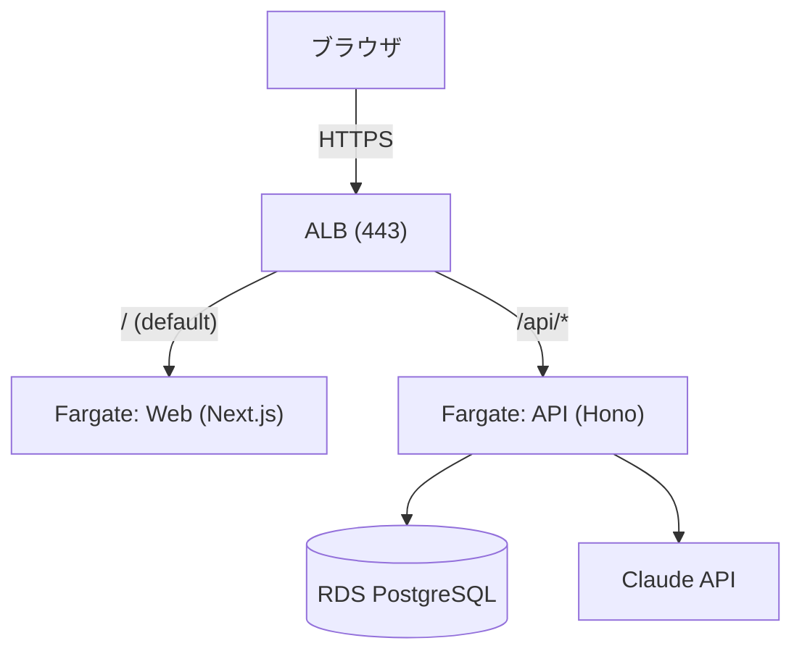

# さくぶんゼミ (v2)

小学生向けの作文添削Webサービス。子どもが書いた作文を AI が添削してフィードバックを返す。

2026年4月に v1 をローンチ（実ユーザー利用中）。本リポジトリは技術スタックを一新した v2（個人開発）。

- 本番サービス (v1): https://www.sakubun-zemi.com
- 技術記事 (Zenn): https://zenn.dev/mmfujii

## 構成

- pnpm モノレポ: Next.js フロント + Hono API + 共有 Zod スキーマ + AWS CDK
- 1 コードベースを `DATABASE_URL` の切り替えだけで複数環境にデプロイ
  - ローカル: Docker Compose
  - AWS: CDK で ECS Fargate + RDS + ALB + Route53 / ACM に IaC 構築（オンデマンド運用）
- AI 添削: Claude API

## アーキテクチャ（AWS）



- Web / API を 1 つの ALB にパス振り分けで同居 → 同一オリジン（CORS なし）
- DB パスワードは Secrets Manager から実行時注入、`DATABASE_URL` はアプリ側で生成（destroy / deploy しても常に最新の RDS を指す）
- デプロイは GitHub Actions + OIDC（長期アクセスキー不要）

設計判断・ハマりどころ → [Zenn 連載](https://zenn.dev/mmfujii)

## 技術スタック

| レイヤー | 技術 |
|---|---|
| フロント | Next.js (App Router) / TypeScript / Tailwind CSS / TanStack Query / React Hook Form / Zod |
| API | Hono / Prisma |
| DB | PostgreSQL（ローカル: Docker / AWS: RDS / Supabase 対応） |
| 認証 | Supabase Auth |
| AI | Claude API |
| インフラ | AWS CDK / ECS Fargate / RDS / ALB / Route53 / ACM / Secrets Manager / Docker |
| CI/CD | GitHub Actions (OIDC) / Turborepo |
| ツール | pnpm / Biome |

## ディレクトリ

```
apps/
  web/        # Next.js (App Router)
  api/        # Hono + Prisma
packages/
  schemas/    # 共有 Zod スキーマ
infra/        # AWS CDK
docs/         # セットアップ・運用ドキュメント
docker-compose.yml
```

## 開発

```bash
pnpm install
pnpm dev          # web / api 起動 (turbo)
pnpm lint         # Biome
pnpm typecheck
pnpm build
```

- ローカル DB セットアップ: [docs/db-setup.md](docs/db-setup.md)
- Supabase Auth セットアップ: [docs/auth-setup.md](docs/auth-setup.md)

## デプロイ

AWS (CDK): [docs/aws-deploy.md](docs/aws-deploy.md) — `pnpm aws:up` / `pnpm aws:down` でワンコマンド起動・停止

## ドキュメント

- [docs/db-setup.md](docs/db-setup.md) — ローカル DB (Prisma + Docker)
- [docs/auth-setup.md](docs/auth-setup.md) — Supabase Auth
- [docs/aws-deploy.md](docs/aws-deploy.md) — AWS デプロイ・運用 runbook

## ライセンス

[LICENSE](LICENSE)
